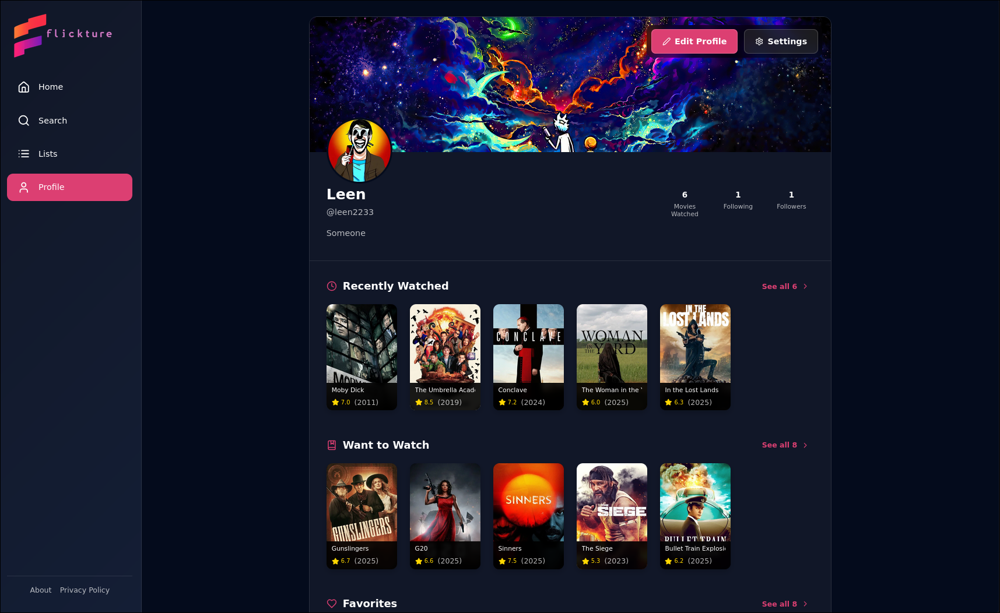

# Flickture Web Application

A modern, responsive web application for discovering, searching, and managing your favorite movies. Built with React and Vite, featuring a beautiful dark-themed UI and seamless user experience.

## ✨ Showcase

Here's a glimpse of what Flickture looks like:

### Discover Page


### Movie Details


### User Profile



## Links

Live: https://flickture.leen2233.me

Backend repo: https://github.com/leen2233/flickture

Mobile repo: https://github.com/leen2233/flickture-mobile

## 🚀 Current Features

### Movie Discovery

- **Advanced Search**: Powerful movie search functionality with real-time results
- **Movie Lists**: Browse popular, now playing, and top-rated movies
- **Detailed Movie Information**: View comprehensive movie details including:
  - Ratings and vote counts
  - Release year
  - Genre information
  - Plot summaries
  - Movie posters

### User Features

- **Personalized Watchlist**: Save movies to watch later
- **User Reviews**: Add personal ratings and reviews
- **Custom Lists**: Create and share custom movie collections
- **Social Features**: Follow other users and share recommendations

### User Experience

- **Responsive Design**: Fully responsive layout that works on desktop and mobile devices
- **Modern UI**: Beautiful dark theme with smooth transitions and animations
- **Loading States**: Elegant loading indicators for better user feedback
- **Error Handling**: User-friendly error messages and fallback states

### Navigation

- **Intuitive Layout**: Clean sidebar navigation with quick access to:
  - Home
  - Search
  - Lists
  - Profile
- **Persistent State**: URL-based search state for shareable results

## 🛠️ Technical Stack

- **Frontend Framework**: React 18
- **Build Tool**: Vite
- **Routing**: React Router DOM
- **HTTP Client**: Axios
- **UI Components**: Lucide React for icons
- **Date Handling**: date-fns
- **Code Quality**: ESLint with React plugins

## 🎯 Planned Features

### UI Enhancements

- **Light/Dark Theme Toggle**: User-selectable color themes
- **Infinite Scrolling**: Smooth loading of large movie lists
- **Rich Movie Details**: Extended information including:
  - Cast and crew details
  - Production information
  - Related videos and trailers
  - Similar movie recommendations

## 🚀 Getting Started

1. **Prerequisites**

   - Node.js (v18 or higher)
   - npm or yarn

2. **Installation**

   ```bash
   # Clone the repository
   git clone [repository-url]

   # Navigate to web directory
   cd web

   # Install dependencies
   npm install
   ```

3. **Development**

   ```bash
   # Start development server
   npm run dev
   ```

4. **Building for Production**

   ```bash
   # Create production build
   npm run build

   # Preview production build
   npm run preview
   ```

## 🤝 Contributing

We welcome contributions! Please feel free to submit a Pull Request.

## 📝 License

This project is licensed under the MIT License - see the LICENSE file for details.

## 🙏 Acknowledgments

- Movie data provided by TMDB API
- Icons by Lucide React
- All the amazing contributors and users of Flickture
